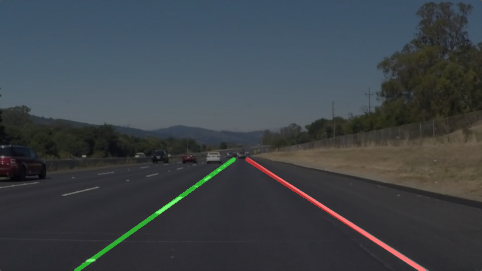

# **Finding Lane Lines on the Road** 

---

**Finding Lane Lines on the Road**

The goals / steps of this project are the following:
* Make a pipeline that finds lane lines on the road
* Reflect on your work in a written report

[//]: # (Image References)

[image1]: ./examples/solidWhiteRight.png

---

### Reflection

### 1. Describe your pipeline. As part of the description, explain how you modified the draw_lines() function.

My pipeline consisted of multiple steps. First, I converted the images to grayscale, then I blurred the images with a 3x3 gaussian kernel. I detected the edges using the canny edge detection with low and high thresholds of 50 and 150 respectively. Then I applied a trapeze mask on those edges to reject most of what's not part of the road. Subsequently, I performed the Hough transform adjusting the parameters to find the lines that belong to lane lines. Here's an example of what the Hough tranform image looks like:

In order to draw a single line on the left and right lane lines, I modified the draw_lines() function by separating lines belonging to the left lane line and to the right lane line according to their slopes. At the same time I computed slopes and origins for each. Then I averaged all left line slopes and origins to determine a final averaged left line slope and orign. I did the same with the right lines. From those averages I could then compute the segment to print from the bottom of image up to the top of the trapeze mask. The final lines found look like this:

### 2. Identify potential shortcomings with your current pipeline
1. One potential shortcoming would be what would happen when sharp road curves in the image (just like on the optional challenge that I didn't have time to do!). 
2. Another shortcoming is the overall robustness of the algorithm. One can see the segments flickering a little, and not very good on some frames.
3. We could find other shortcomings in situations we did not test during this project such as changing lanes and we would certainly have an issue on countryside roads without proper line markings!

### 3. Suggest possible improvements to your pipeline
1. A possible improvement with curves in the road (see 2.1) would be to a fit second order model instead of lines or maybe break the lines into shorter sgements.
2. To make the final lines more robust, we could also perform some kind of temporal (frame-to-frame) smoothing as we know the lines 
2. Another possible improvement would be to perform edge detection only inside the masked region to reduce CPU load.
